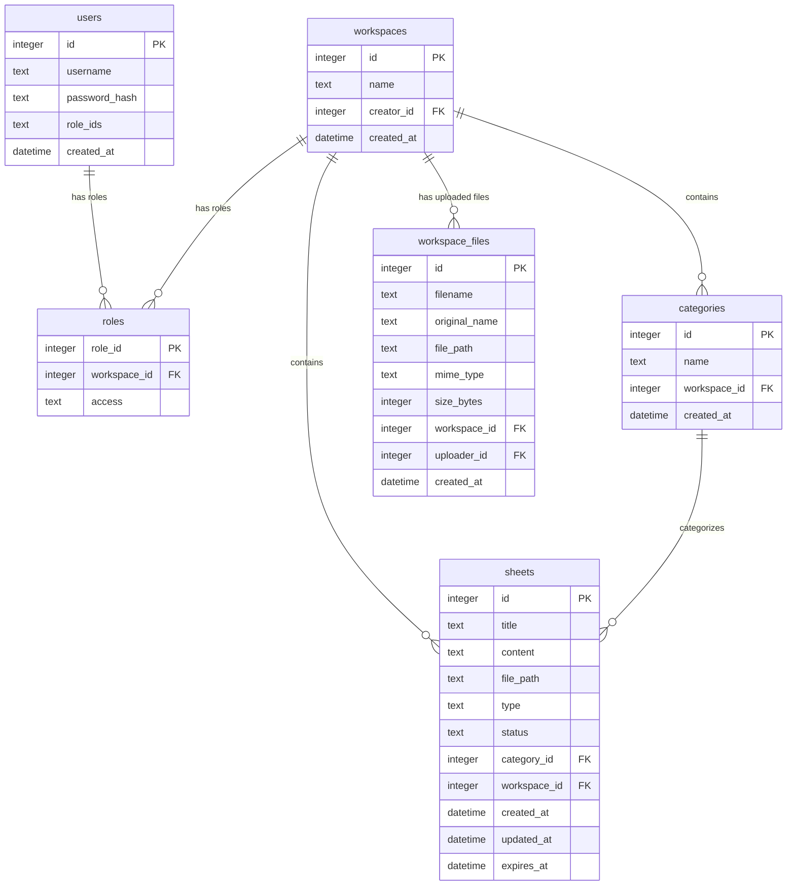

# SyncPad Backend (Shared Real-time Workspace Clipboard Server)

> [!IMPORTANT]
> **Core Mission:** SyncPad Backend is the server-side REST API and real-time Socket.io engine for SyncPad. It coordinates collaborative rich-text editing rooms, handles editing lock ownership allocation, runs cron auto-archivers, validates role-based workspace authorizations, and manages local storage files for archived sheets and drive uploads.

<p align="center">
  <strong>Real-time WebSocket Rooms</strong> &bull;
  <strong>Collaborative Locking Engine</strong> &bull;
  <strong>Stateless JWT Cookies</strong> &bull;
  <strong>Disk-Based Archiver</strong> &bull;
  <strong>SQLite DB Health Checks</strong>
</p>

<p align="center">
  <strong>Health Check URL: (Live app)</strong> <a href="https://apis.satishg.in/syncpad/api/db/health" target="_blank">apis.satishg.in/syncpad</a>
</p>

<p align="center">
  Looking for the frontend repository? Check out the <a href="https://github.com/09satishgs/sync-pad-frontend/blob/master/README.md">SyncPad Frontend README</a> for user interface details and Vite configuration.
</p>

---

## Table of Contents

- [Why This Project Exists](#why-this-project-exists)
- [Who This README Is For](#who-this-readme-is-for)
- [How The System Works (Technical Architecture)](#how-the-system-works-technical-architecture)
- [REST API Endpoints Tree](#rest-api-endpoints-tree)
- [WebSocket Namespace & Event Protocols](#websocket-namespace--event-protocols)
- [Database Schema & Migrations](#database-schema--migrations)
- [Local Development](#local-development)
- [Tech Stack](#tech-stack)

---

## Why This Project Exists

### The Problem

Traditional clipboard utilities are local, single-user, and lack organization. When multiple users attempt to share config files, API keys, or text scripts collaboratively, they resort to messaging channels which cause concurrent-edit conflicts, formatting loss, and database clutter.

### The Solution

SyncPad Backend provides a lightweight, performant server engine that handles real-time cursor sync, locks, and file storage.

- **WebSocket Room Syncing:**Keystrokes are transmitted instantly via WebSockets and persisted to SQLite asynchronously to ensure smooth collaborative rich-text typing.
- **Conflict Prevention:** Manages editing locks reactively. The first user to join a sheet gets the editing lock; other concurrent viewers are kept in a read-only state until they request to "Take Control".
- **Disk-Based Archiving Optimization:** Keeps the database lean. Archived sheets are saved as `.txt` files containing raw rich-text formatting on disk rather than bloating SQLite database rows.
- **Workspace File sharing:** Features a workspace-scoped drive using local filesystem storage mapped with access authentication guards.

---

## Who This README Is For

| Audience                   | Start Here                                                           | Why                                                                             |
| -------------------------- | -------------------------------------------------------------------- | ------------------------------------------------------------------------------- |
| **System Administrators**  | [Local Development](#local-development)                              | Set up environment configurations, SQLite permissions, and startup variables.   |
| **Developers / Reviewers** | [How The System Works](#how-the-system-works-technical-architecture) | Inspect dependency injection, socket lifecycle states, and repository patterns. |
| **Frontend Integrators**   | [REST API Endpoints Tree](#rest-api-endpoints-tree)                  | Integrate routes, payloads, WebSocket message triggers, and download endpoints. |

---

## How The System Works (Technical Architecture)

```
                            +----------------------------------+
                            |          src/server.js           |
                            | (Bootstraps DB, Cron & Sockets)  |
                            +-----------------+----------------+
                                              |
                        +---------------------+---------------------+
                        v                                           v
            +-----------------------+                   +-----------------------+
            |      src/app.js       |                   |  src/sockets/         |
            | (Express REST routes) |                   |  socketHandler.js     |
            +-----------+-----------+                   +-----------+-----------+
                        |                                           |
                        +---------------------+---------------------+
                                              v
                                   +---------------------+
                                   |     src/config/     |
                                   |       di.js         |
                                   | (Dependency Injection)
                                   +----------+----------+
                                              |
                                              v
                                   +---------------------+
                                   |    src/services/    |
                                   |  (Business Logic)   |
                                   +----------+----------+
                                              |
                                              v
                                   +---------------------+
                                   |  src/repositories/  |
                                   |    (Database I/O)   |
                                   +----------+----------+
                                              |
                                              v
                                      [(SQLite Database)]
                                              +
                                      [(Local Storage/)]
```

### 1. Dependency Injection Pattern (`di.js`)

The application avoids global variable clutter by instantiating repositories, services, and controllers in [di.js](./src/config/di.js) and injects dependencies down.

### 2. Physical File Storage Engine (`fileStorageService.js`)

All uploads and archived sheets reside in an isolated `storage/` directory in the project root:

- **Uploads Drive:** Saved at `storage/workspaces/{workspace_id}/uploads/{unique_filename}`.
- **Sheet Archives:** Saved at `storage/workspaces/{workspace_id}/archives/archive_{sheet_id}.txt`.

### 3. Database Table Auto-Migration

On start, the initialization process inspects the tables. If migrating from older database versions, it runs `ALTER TABLE sheets ADD COLUMN file_path TEXT DEFAULT NULL` dynamically to add columns without dropping existing data.

---

## REST API Endpoints Tree

All endpoints are prefixed with `/syncpad/api` and require cookie token authentication (`authenticate` middleware) except registration, login, and the health check endpoint.

### 🔑 Authentication Routes (`/auth`)

- `POST /auth/register` - Registers a new username and password hash.
- `POST /auth/login` - Validates credentials, signs a JWT, and stores it in an HttpOnly, Secure cookie.
- `POST /auth/logout` - Clears the session cookie.
- `GET /auth/session` - Decodes the JWT and returns the current user profile.
- `POST /auth/session/refresh` - Re-evaluates user roles in the database, signs an updated JWT token, and refreshes the session cookie.

### 💼 Workspace Routes (`/workspaces`)

- `POST /workspaces` - Creates a new workspace and assigns the creator as `maintainer`.
- `GET /workspaces` - Lists all workspaces that the user has membership/maintainer roles in.
- `POST /workspaces/:id/members` - Invites/adds a member to the workspace (requires `maintainer` role).
- `GET /workspaces/:id/members` - Lists all members of a workspace.

### 📄 Sheet Routes (`/workspaces/:workspaceId/sheets`)

- `GET /sheets/live` - Gets the active live sheet or creates a blank one if expired.
- `PUT /sheets/live` - Persists keystrokes or editing updates.
- `POST /sheets/save-live` - Saves live sheet to the database, converting status to `'saved'`.
- `POST /sheets/archive-live` - Saves live sheet text content to disk as a `.txt` file, nullifies `content` in database, sets `file_path`, and sets status to `'archived'`.
- `POST /sheets/delete-live` - Deletes the active live sheet.
- `GET /sheets/saved` - Lists all saved sheets in the workspace.
- `GET /sheets/archived` - Lists all archived sheets in the workspace.
- `POST /sheets/saved` - Direct saved sheet creation inside folders/categories.
- `PUT /sheets/saved/:id` - Updates saved sheet title and category.
- `DELETE /sheets/saved/:id` - Deletes a sheet (and unlinks its `.txt` file from disk if it was archived).
- `POST /sheets/load/:id` - Pulls a saved or archived sheet into the live editor room (reads from disk if status is archived).

### 📁 Workspace Drive Files Routes (`/workspaces/:workspaceId/files`)

- `POST /files` - Uploads a workspace document/file (parsed via `multer` memory buffer and persisted to disk).
- `GET /files` - Lists all files metadata in the workspace.
- `GET /files/:fileId/download` - Streams a file download (verifies workspace access credentials).
- `DELETE /files/:fileId` - Deletes file metadata and unlinks binary from disk.

### 📂 Category Routes (`/workspaces/:workspaceId/sheets/categories`)

- `GET /categories` - Lists category folders.
- `POST /categories` - Creates a category.
- `DELETE /categories/:id` - Deletes a category.

### 🛠️ Admin Dashboard Routes (`/admin`)

Requires global `admin` credentials (e.g. `workspace_id = null`, `access = 'admin'`).

- `GET /admin/tables` - Database explorer listing SQLite tables.
- `GET /admin/tables/:tableName` - Returns table rows with paginated limits (strips `password_hash` fields).
- `GET /admin/users` - Lists registered users and roles list.
- `POST /admin/workspaces` - Creates a workspace and assigns target user as maintainer.
- `POST /admin/workspaces/:workspaceId/members` - Manually joins user to workspace.
- `PUT /admin/users/:id/roles` - Overrides a user's roles mapping.

### 🩺 Health Route

- `GET /db/health` - Performs connection ping (`SELECT 1`) to check if SQLite is connected and responsive. Does not require authentication.

---

## WebSocket Namespace & Event Protocols

All socket connections use the `/syncpad` namespace. Client auth is validated on connection by parsing the HTTP cookie headers.

### Sockets State Mapping

- `sheetLocks`: In-memory `Map(sheetId -> { socketId, username })` holding active locks.

### Inbound Events (Client -> Server)

- `client_viewing_sheet` - Client joins a room `sheet_{sheetId}`. Returns `sheet_lock_status`.
- `client_take_control_sheet` - Request to steal editing lock. Transfers lock and broadcasts status.
- `client_edit_sheet` - Sends real-time editor text. Broadcasts changes and schedules async DB update.
- `client_sheets_list_modified` - Broadcasts update to refresh everyone's sidebar list.
- `disconnect` - Fired on tab closed. Releases locks and transfers them to the next visitor.

### Outbound Events (Server -> Client)

- `sheet_lock_status` - Broadcasts `{ isLocked, lockedBy, lockedBySocketId }` to room.
- `server_sheet_content_updated` - Broadcasts raw editor changes.
- `server_sheet_background_updated` - Notifies other tabs that a sheet has been updated in the background.

---

## Database Schema & Migrations



---

## Local Development

### Prerequisites

- Node.js 18+
- SQLite3 CLI (optional, for DB debugging)

### Setup Instructions

1. **Install dependencies:**

   ```bash
   npm install
   ```

2. **Configure Environment Variables:**
   Create a `.env` file in the root folder:

   ```bash
   PORT=5000
   DATABASE_URL=database.db
   JWT_SECRET=your_jwt_secret_key_here
   COOKIE_SECRET=your_cookie_secret_here
   CORS_ORIGIN=http://localhost:5173
   ```

3. **Run local development (Nodemon):**

   ```bash
   npm run dev
   ```

   _The server runs locally at: `http://localhost:5000` and creates `database.db` automatically._

4. **Run production server:**

   ```bash
   npm start
   ```

5. **API Testing with Postman:**
   Import the pre-configured [SyncPad_Backend.postman_collection.json](./SyncPad_Backend.postman_collection.json) directly into Postman to easily query and test all workspace, sheet, auth, category, upload, and admin endpoints.

---

## Tech Stack

| Layer / Dependency    | Technology                   | Purpose                                                               |
| --------------------- | ---------------------------- | --------------------------------------------------------------------- |
| **HTTP Engine**       | Express.js 4                 | Renders REST controllers and routes.                                  |
| **Real-time Gateway** | Socket.io 4                  | Manages persistent connections, room routing, and lock transmission.  |
| **Database**          | SQLite3 (via sqlite3 client) | Embedded database storing schemas, roles, and text history.           |
| **File Parser**       | Multer 1                     | Handles file upload memory streams.                                   |
| **Encryption**        | Bcryptjs 2                   | Hashes password credentials.                                          |
| **Authorizations**    | JSONWebToken 9               | Encodes, signs, and decodes stateless session authentication cookies. |

---

## Tradeoffs / Constraints

- **SQLite Database**: Chosen for its zero-configuration, zero-dependency, and lightweight filesystem footprint. This allows the application to run with minimal CPU/RAM overhead on a personal mini-pc (or low-spec home lab hardware). While SQLite has tradeoffs like serialized write locks and limited high-concurrency scaling, these constraints do not apply to our use case. Client text typing updates are throttled/debounced, and the concurrency level in a private workspace environment does not exceed the write throughput capacity of SQLite.
- **Disk-Based Archiving**: Since archived sheets are not used for editing directly (acting as read-only snapshots), offloading them to flat `.txt` files is highly efficient. This prevents SQLite database bloat, keeping database indexes extremely small and fast to scan, making the overall system scalable over long periods.
- **In-Memory Lock Management**: Collaborative editing locks are held in-memory (utilizing a JS `Map` data structure), allowing for constant-time O(1) lookup and validation checks. If the server process restarts (a constraint on mini-pc environments), locks are relinquished, but the client automatically reconnects and re-negotiates locks seamlessly.

---

## Planned Future Updates

- **Structured JSON Logging**: Implement a logging middleware (using `pino`) to output structured JSON logs.
- **Cloud Log Backups**: Archive and compress log files older than 30 days, offloading them automatically to Google Cloud Storage (GCS) to reclaim local disk space. This process will utilize a sliding window syncing mechanism to continuously sync logs and keep a rolling 30-day buffer locally.
- **On-Demand Log Retrieval**: Build an admin-restricted endpoint (`GET /syncpad/api/admin/logs`) to stream and search through cloud-archived logs on demand using timestamps. For recent logs (local 30-day window), it will feature efficient text filtering and lightweight semantic search capabilities using standard client-side text vectorization, which is standard for quick log diagnostics.
